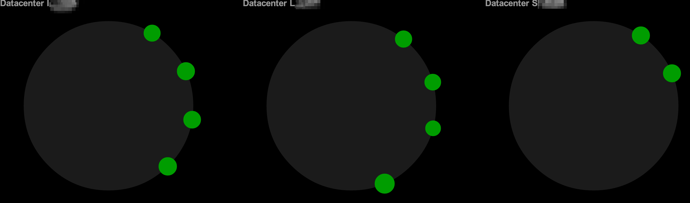

## Agenda

1. whoami
1. What is Cassandra
1. Glossary
1. Cassandra Current State
1. Connection Options
1. Data Modeling
1. Anti Patterns
1. Links

~~~~
## whoami

Jeff Beck

beckje01 on GitHub and Twitter

TechLead at ReachLocal
~~~~
## What is Cassandra

  * Highly-Available, Distributed, Tuned Consistency
  * Master-less Replication
  * redundancy configurable per table
  * Cluster can span DCs
  * Flexible schema
~~
### Consistency

Great talk on Cassandra consistency, _Eventual Consistency != Hopeful Consistency_

[Video](http://www.youtube.com/watch?v=A6qzx_HE3EU)
[Slides](http://www.slideshare.net/planetcassandra/c-summit-2013-eventual-consistency-hopeful-consistency-by-christos-kalantzis)
~~

~~~~
## Glossary

  * [CAP Theorem](http://en.wikipedia.org/wiki/CAP_theorem) - Consistency, Availability, and Partition tolerance
  * Cluster, DataCenter, Rack 
  * Partitioner
  * Thrift
  * Quorum, Local Quorum

~~
## Glossary

  * DSE
  * Node Discovery
  * Load Balancing
  * Replication Strategy

~~~~
## Cassandra Today

  * Cassandra 2.0
  * CQL3
  * Java Native Driver
  * Murmur3Partitioner

~~
## Cassandra Common Setup

  * Astyanax
  * C* 1.2
  * Wide Column Design

~~~~
## Connection Options

  * Astyanax
  * Hector
  * CQL|Java (JDBC)
  * 4-5 less popular ones
~~
## Astyanax

Thrift based with varying compatibility. Also supports some CQL3 via Thrift.

See Astyanax [Cassandra Compatability](https://github.com/Netflix/astyanax/wiki/Cassandra-compatibility)

~~
## Hector

Not as popular anymore, allows for connection pooling etc. Based on Thrift.

~~
## CQL - JDBC Based Solutions

Avoid these currently are not cluster aware so a single node failure can cause problems. Or you have to follow the bad practice having a LB in front of the cluster.
~~
## 4-5 More Clients

There are a lot of other clients and ORMs built out around Java check out all them [here](http://www.datastax.com/download/clientdrivers).
~~~~
## Java Native Driver

Based around CQL3 and a new binary protocol. Supports node discovery, load balancing and failover. Encourages CQL3 based data design.
~~
## Java Native Driver

CQL prepared statements claim to be 10% faster than thrift, with the first release. You have to model your data more like a traditional DB. It is new and comes in two flavors.

~~
## Java Native Driver 1.x

Currently a generally available client, [docs](http://www.datastax.com/documentation/developer/java-driver/1.0/index.html) are good to help get you started. You don't get all the great async work that has been done in 2.x

~~
## Java Native Driver 2.x

Many breaking changes for the upgrade and requires Cassandra 2.0 for full feature set many items such as result set paging will throw an exception if used against a 1.2 C*. Current state is 2.0.1, it does have nice async support with futures.
~~~~
## State of Astyanax

Netflix announced that they will be updating Astyanax to support both the new binary protocol and thrift. [Read here](http://techblog.netflix.com/2013/12/astyanax-update.html). There is even a beta out of [Astyanax Over Java Driver](https://github.com/Netflix/astyanax/wiki/Astyanax-over-Java-Driver) very early.

~~~~
## Data Modeling in Cassandra

Model what you want to query for not the data.

This part is hard there will be mistakes.
~~
### Hints

  * Duplicate Data
  * Good Compound Primary Key
  * Hire a Consultant
  * Careful around adding an index

~~~~
## Anti Patterns

  * Read Before Write
  * Load Balancer
  * Excessive Heap Space
  * Use of order-preserving partitioner

[Slides](http://www.slideshare.net/mattdennis/strangeloop-2012-apache-cassandra-anti-patterns)

~~~~
## Links

  * [Current Docs](http://www.datastax.com/documentation/cassandra/2.0/cassandra/gettingStartedCassandraIntro.html)
  * [Java Driver GitHub](https://github.com/datastax/java-driver)
  * [SandBox](http://www.datastax.com/what-we-offer/products-services/sandbox)
  * [Scott Hirleman](https://twitter.com/shirleman) - Lots of good retweets of videos, slides, etc.

~~~~
## Extras

    CREATE KEYSPACE Simple
            WITH REPLICATION = {'class' : 'SimpleStrategy',
                                'replication_factor': 1};

    CREATE TABLE Person (
         firstName varchar,
         lastName varchar,
         age int,
        PRIMARY KEY (lastName,firstName)
    ); 

~~

    insert into person (firstname, lastname, age) values ('Jeff','Beck',30) ;
    insert into person (firstname, lastname, age) values ('Bob','Beck',60) ;

~~

    create table alist (
     page varchar,
     visits list <timestamp>,
     PRIMARY KEY(page)
    );

~~~~
## Local Cassandra Meetup

http://www.meetup.com/Minneapolis-St-Paul-Cassandra-Meetup/
http://bit.ly/C-MSP